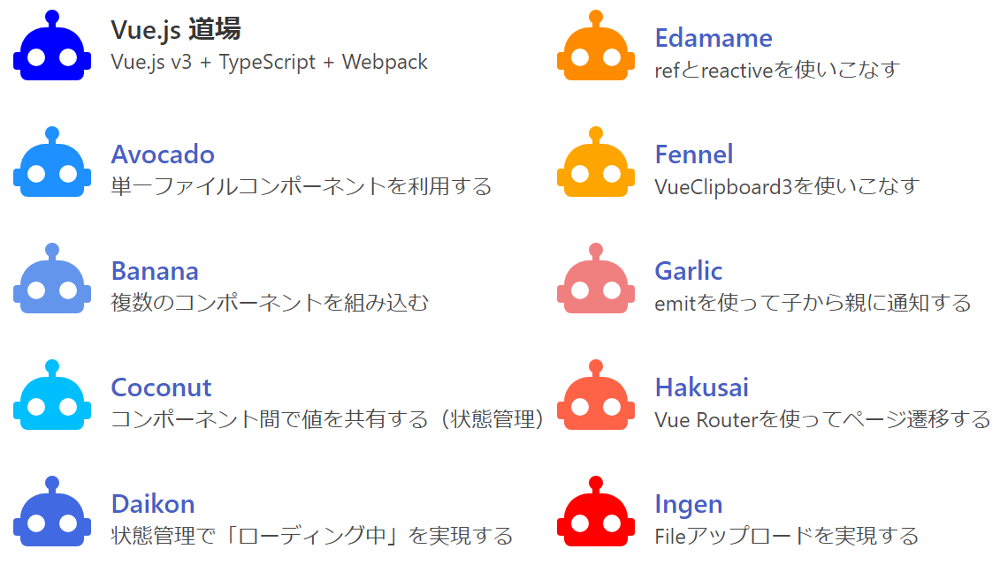

# vuejs-dojo 概要

Vue.js 道場（Vue.js v3 + TypeScript + Webpack サンプルコード集）

作成日 2023/08/10、更新日 2023/08/30



## 01. ファイル・フォルダ構成

```text
--vuejs-dojo/
    |--docs/
    |   |--Expressサーバー構築  ... 追加セットアップ
    |   |--Vuejs開発環境  ... セットアップとトラブルシューティング
    |   `--Vuejs仕様まとめ ... ソースコードを読むのに最低限必要な知識
    |--public/  ... コンパイル後のJavaScriptファイルの置き場
    |--src/     ... コンパイル前のTypeScriptファイルの置き場
    |--temp/    ... 一時的なファイルの置き場
    `--server.js  ... Expressサーバーの本体
```

## 02. Node.js 開発環境

- OS は、Ubuntu または WSL Ubuntu を前提とし、Windows 上での動作は対象外とする
- Node.js がインストール済みであることとする
- エディタは、Visual Studio Code の利用を想定する

```bash
cd ~/vuejs-dojo

# Node.jsのバージョン確認
node -v
# => v18.17.1
npm -v
# => 9.6.7

# パッケージのインストール
npm install
```

### インストールしておくべき Visual Studio Code の機能拡張

- indent-rainbow
- IntelliCode
- ESLint
- markdownlint
- Prettier
- TypeScript Vue Plugin (Volar)
- Vue Language Features (Volar)

## 03. スクリプト実行

```bash
cd ~/vuejs-dojo

# 開発サーバーの起動
npm run dev
# => ブラウザで http://localhost:8080 を開く

# JSファイルのビルド
npm run build

# Expressサーバーの起動（※）
npm start
# => ブラウザで http://localhost:3000 を開く
```

※ `npm start`は暗黙のうちに`node server.js`に紐づいている
